# Crew Weather App

The CREW Weather App is designed to provide an intuitive and comprehensive breakdown of the weather in any user-requested location. Below are the descriptions of the main features and functionalities illustrated in the provided images.

## Features

### 1. Home Page
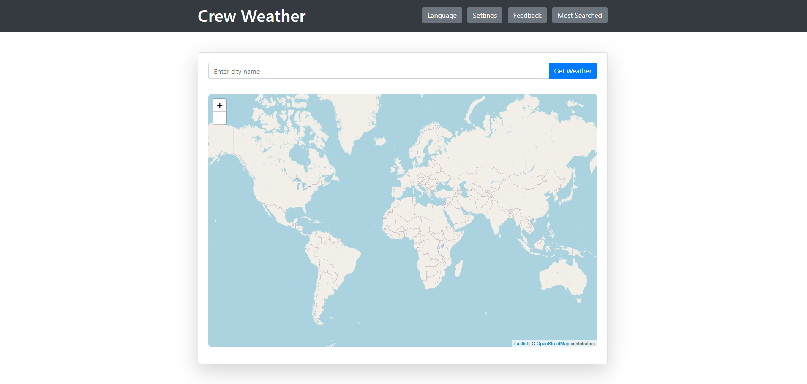
- **Search Bar**: Enter the location to get weather information.
- **Settings**: Access the settings to customize the app.
- **Most Searched Locations**: Quick access to frequently searched locations.
- **Interactive Map**: A clickable and interactive map.

### 2. Language Selection
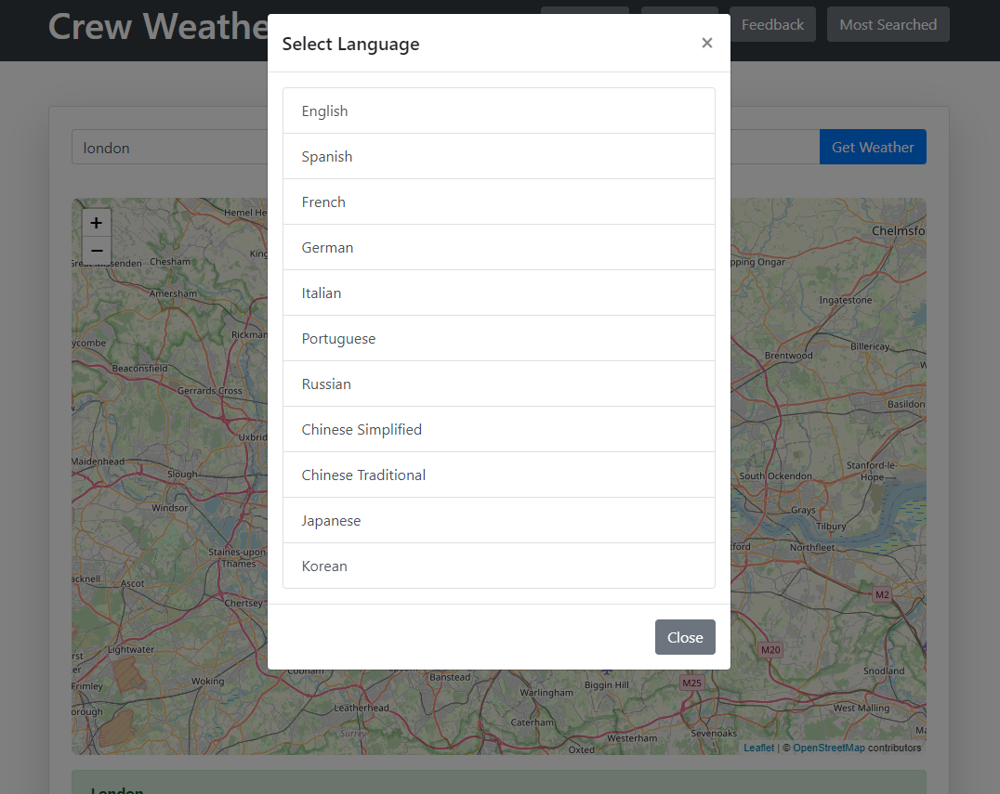
- **Languages Available**: 
  - English
  - Spanish
  - French
  - German
  - Portuguese
  - Russian
  - Italian
  - Japanese
  - Chinese Traditional
  - Korean
  - Chinese Simplified

### 3. Settings
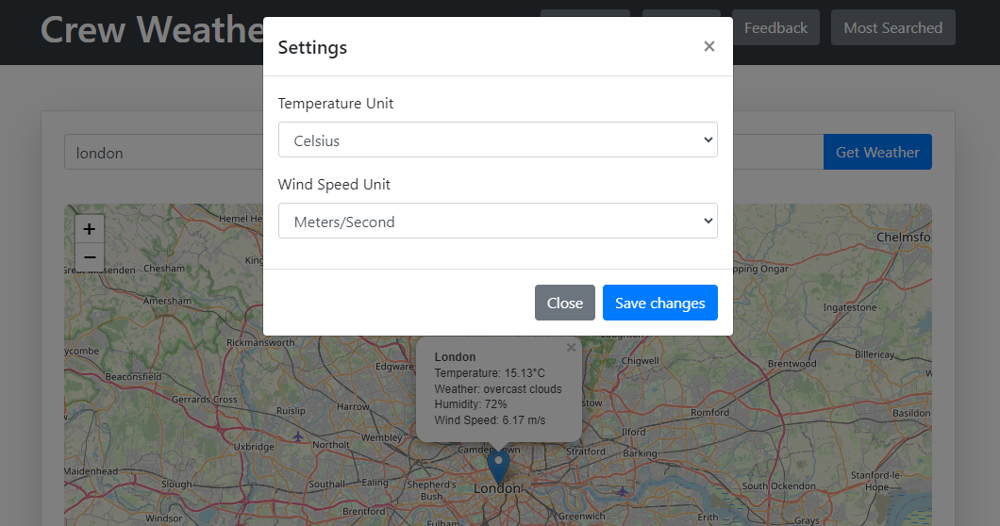
- **Temperature Units**: Choose between Celsius and other units.
- **Wind Speed Units**: Option to set wind speed units to meters/seconds.
- **Save Changes**: Button to save the customized settings.

### 4. Feedback
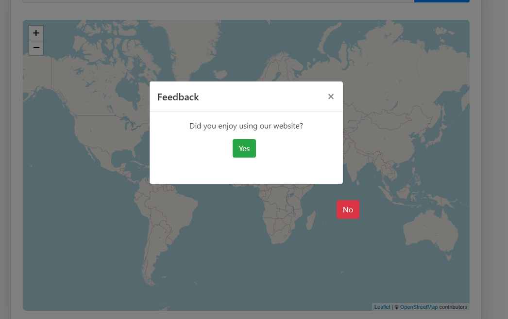
- **User Experience**: Prompt asking if the user enjoyed using the app.
- **Response Options**: Simple Yes or No buttons for user feedback.
- **Naughty NO button**: The No button seems to be misbehaving

### 5. Most Searched Locations
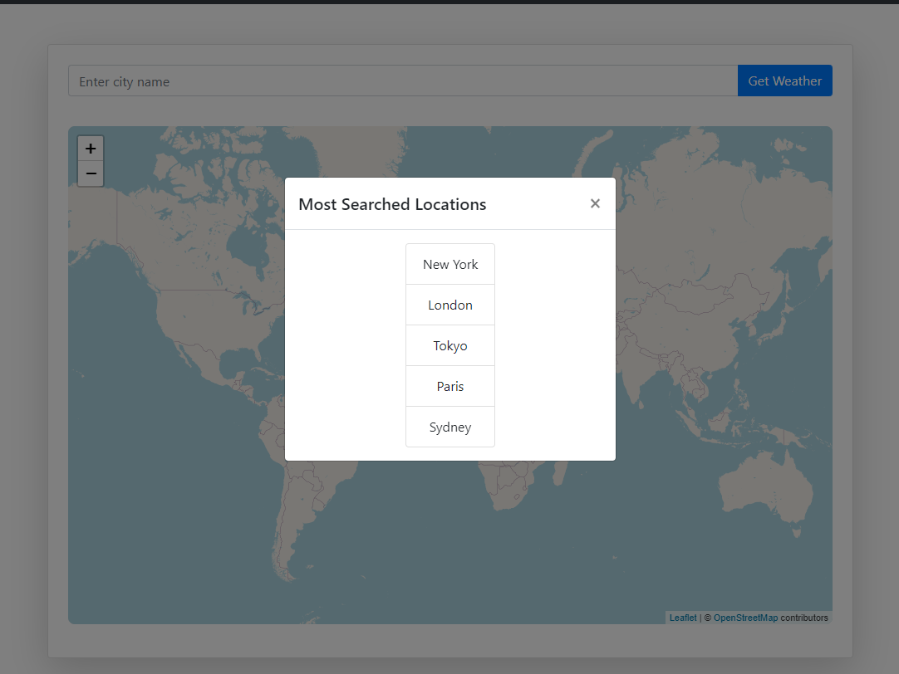
- **Popular Locations**:
  - New York
  - London
  - Tokyo
  - Paris
  - Sydney
- **Quick Access**: Tap on any of the most searched locations to view the weather details immediately.

### 6. Mobile Home Page Design
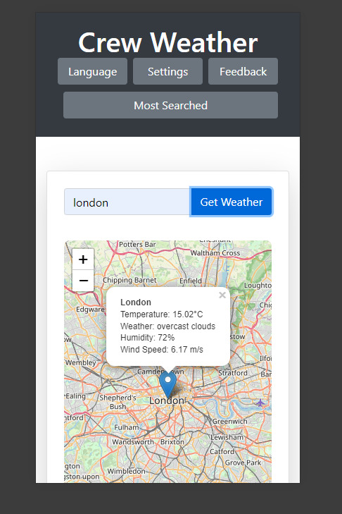
- **Fully responsive**: Current time displayed at the top.

---

### How to Use

1. **Search for a Location**: Use the search bar to enter any location and get the weather details.
2. **Change Settings**: Customize your temperature and wind speed units in the settings.
3. **Select Language**: Choose your preferred language from the language settings.
4. **Give Feedback**: Let us know your experience by using the feedback option.
5. **Access Popular Locations**: Quickly check the weather for the most searched cities.
6. **Interactive Map**: Click on the map at the location you wish to view the weather.

### Future Updates

- **Enhanced Map Features**: Additional interactive features on the map, more cities, different types of maps.
- **More Languages**: Expanding language options for wider accessibility.
- **User Personalization**: More personalized settings and user preferences.

---

### Wireframe images

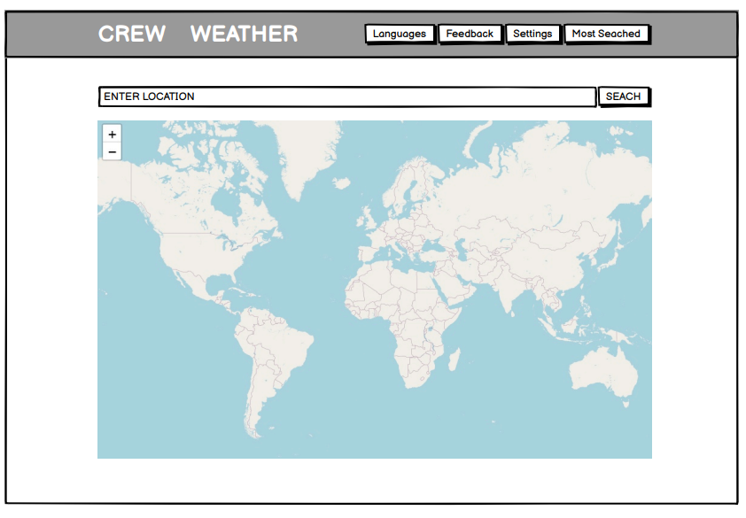
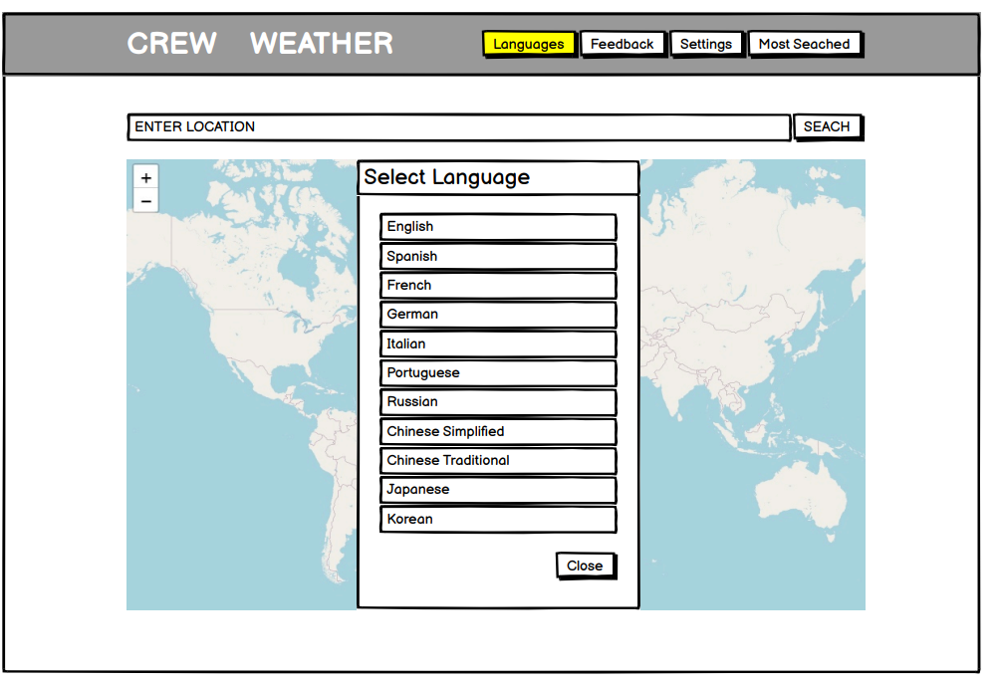
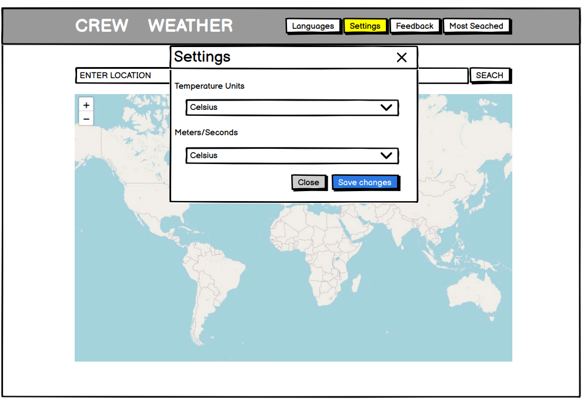
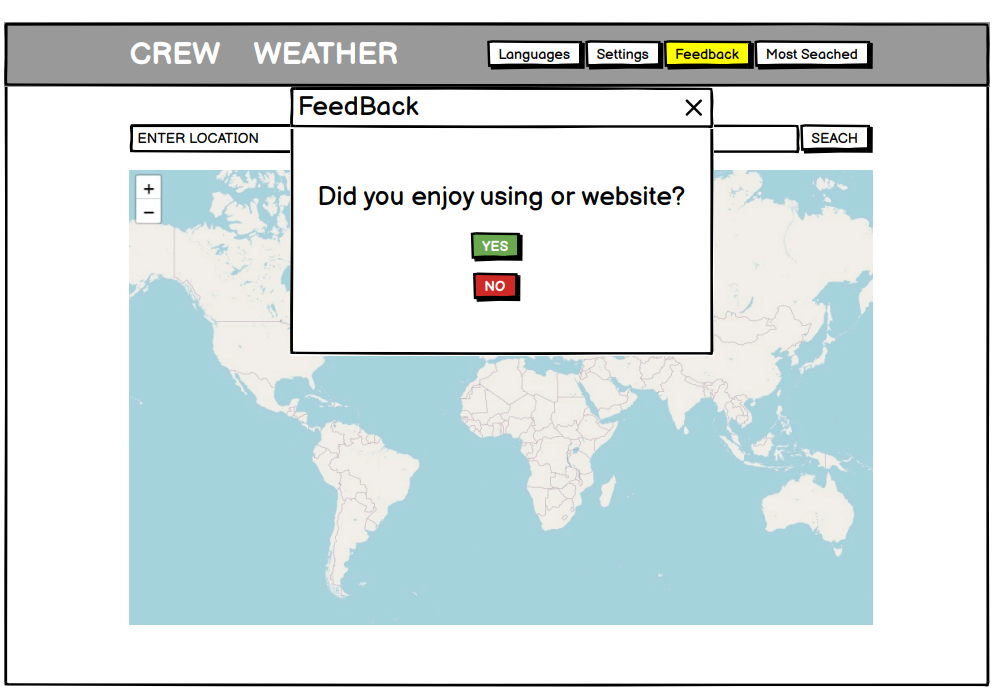
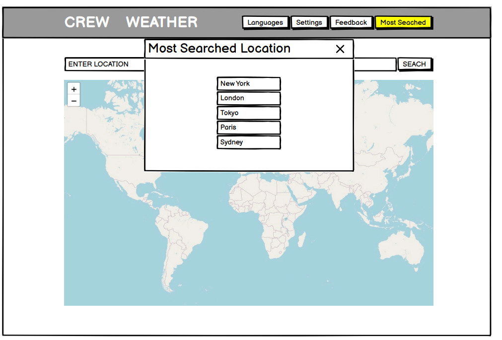
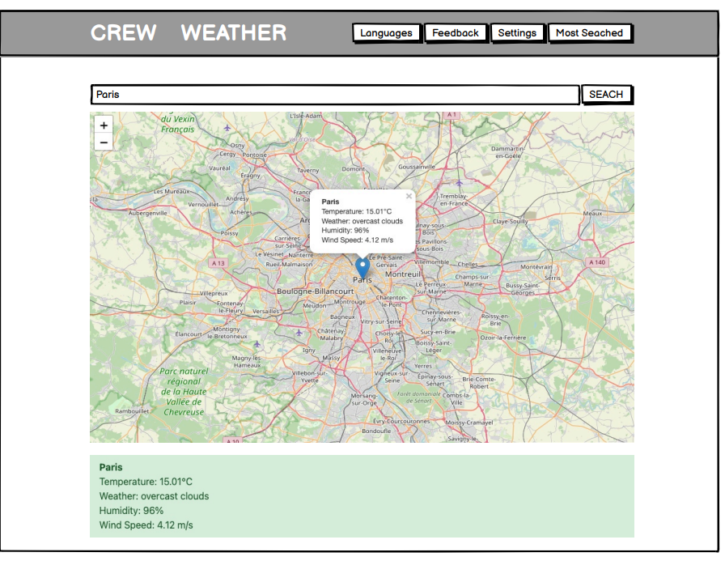
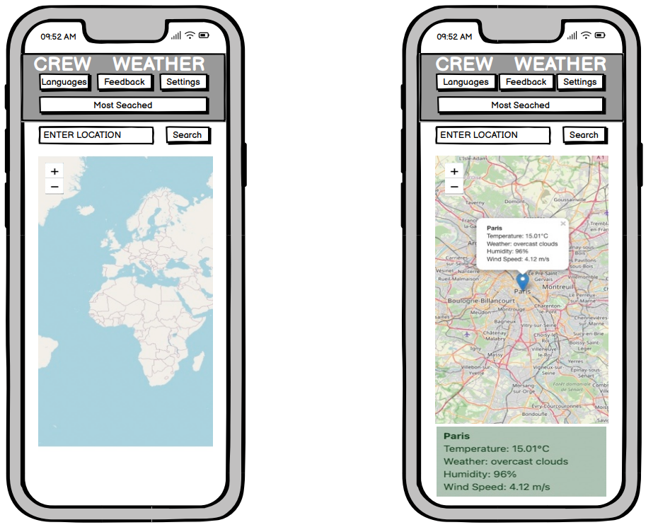
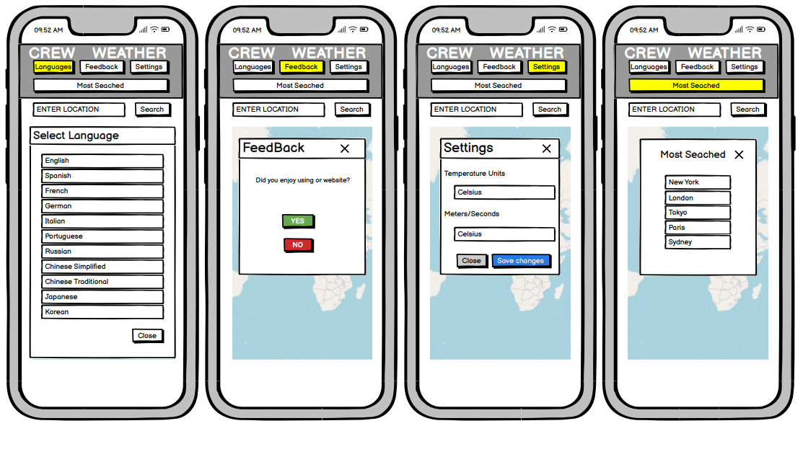

### Validators:

- **W3C CSS Validator**

- **NU HTML Checker**
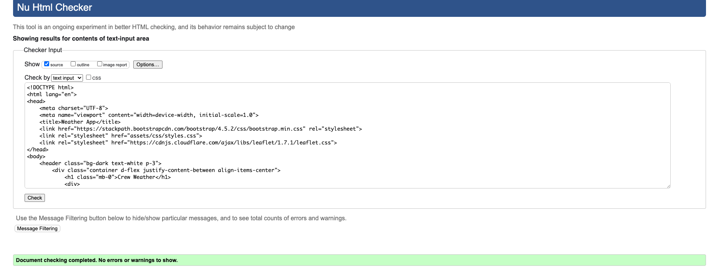

### Resources:
- **API**: https://openweathermap.org/
- **Map**: openstreetmap.org
- **Javascript Library**: https://leafletjs.com/
- 

This was a collaborative project for our 2nd hackathon project with the Code-institute bootcamp 2024